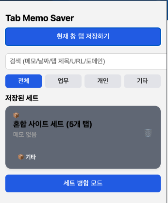
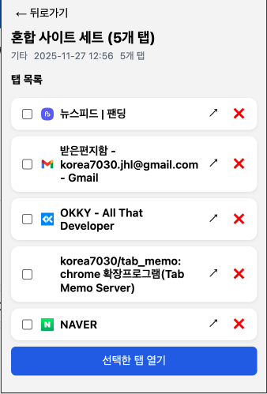

# Tab Memo Saver 🗂️  
크롬(Chrome) 탭을 세트로 저장하고 — 후에 언제든 다시 열 수 있게 도와주는 확장 프로그램

---

## 🚀 한 문장 요약  
“탭 수십 개 열어둬도 걱정 끝 — 클릭 한 번으로 저장하고, 나중에 한 번에 복원.”  

---

## 💡 왜 만들었나  
- 개발 / 리서치 / 쇼핑 등으로 탭을 많이 열다 보면,  
  크롬이 느려지고 탭이 많아져서 관리가 힘들어지더라.  
- 닫았다가 나중에 다시 찾으려면 URL 기억이나 히스토리 뒤지느라 시간 낭비 + 스트레스.  
- 기존 세션 관리 확장 프로그램은 기능이 많지만,  
  내 흐름엔 너무 무겁거나 디자인이 마음에 들지 않았다.  
- 그래서 **“단순하고 직관적인 탭 세이브 & 리스토어 + 메모/분류/검색”**만 있는,  
  나만의 탭 관리 도구를 만들기로 했다.

---

## ✅ 주요 기능

| 기능 | 설명 |
|------|------|
| **현재 창 탭 저장** | 열려 있는 모든 탭을 세트로 저장 (URL, 제목, favicon) |
| **자동 제목 + 자동 카테고리 분류** | 도메인 기반으로 “업무 / 개인 / 기타” 자동 분류 & 제목 생성 |
| **세트 목록 / 검색 / 필터링** | 메모 / 날짜 / 탭 제목 / URL / 도메인 기반으로 검색 / 업무·개인·기타 필터 |
| **세트 병합** | 여러 세트를 하나로 합치고 중복 URL 제거 |
| **세트 불러오기** | 전체 탭 열기 또는 선택한 탭만 열기 |
| **개별 탭 삭제 / 열기 / 복원** | 세트 상세 보기에서 탭별 제어 가능 |
| **메모 & 제목 편집** | 세트에 메모 남기기, 제목 변경 가능 |

> 참고: 최신 기능 및 버그는 **Issues** 탭 참고 바람  

---

## 🖼 스크린샷  
*(실제 UI 예시 — Popup / 세트 목록)*

| 저장 화면 | 세트 목록 |
|---|---|
|  |  |

---

## 📥 설치  

Chrome 웹스토어에서 [**Tab Memo Saver**](https://chromewebstore.google.com/detail/tab-memo-saver/hndhdhmabldeikidmnhafgcfjfknjeio?hl=ko&utm_source=ext_sidebar)를 검색하거나, 아래 버튼을 눌러 설치하세요.  
  
[**Chrome Web Store → Tab Memo Saver**](https://chromewebstore.google.com/detail/tab-memo-saver/hndhdhmabldeikidmnhafgcfjfknjeio?hl=ko&utm_source=ext_sidebar)  

> 개발자용으로 직접 사용하려면  
> 1. 이 레포지토리 Clone  
> 2. `chrome://extensions` → “압축해제된 확장 프로그램 로드” → 폴더 선택  
> 이렇게 로드하면 됩니다.

---

## 🛠 개발 / 빌드 환경  

| 항목 | 내용 |
|------|------|
| HTML / CSS / JS | 순수 웹 기술 (manifest v3 + vanilla JS) |
| 저장 방식 | `chrome.storage.local` 사용 (사용자 로컬에만 저장) |
| 권한 | `tabs`, `storage`, `windows` — 탭 정보 조회 & 저장 / 윈도우 생성 / 데이터 저장 위해 필요 |
| 빌드 툴 | 없음 — 브라우저가 바로 읽음 |

---

## 📚 개발 중 느낀 점 & 배운 점  
- 자동 저장 & 병합 기능은 좋은 의도였지만,  
  **“언제 저장되는지”를 사용자에게 명확히 알려줘야** UX가 매끄럽다.  
- 도메인 기반 분류는 완벽하진 않지만,  
  단순하고 빠르게 카테고리 정리할 수 있어 쓸만했다.  
- 탭 수가 많아지면 렌더링 / 메모리 관리가 중요해짐 —  
  저장 구조 최적화 필요성 체감  

---

## 🔭 로드맵 (예정 기능)  
- 다크 모드 / 테마 지원  
- 세트 즐겨찾기 / 고정(Pin) 기능  
- 세트 백업 / 복원 / 내보내기 (JSON)  
- 탭 썸네일 / 미리보기  
- 브라우저 간 동기화 (클라우드)  

---

## 🤝 기여 환영  
버그 리포트, 기능 제안, PR 모두 환영합니다.  
원한다면 이슈나 Discussions 탭에 의견 남겨 주세요!  

---

## 👤 개발자  
[korea7030](https://github.com/korea7030)  